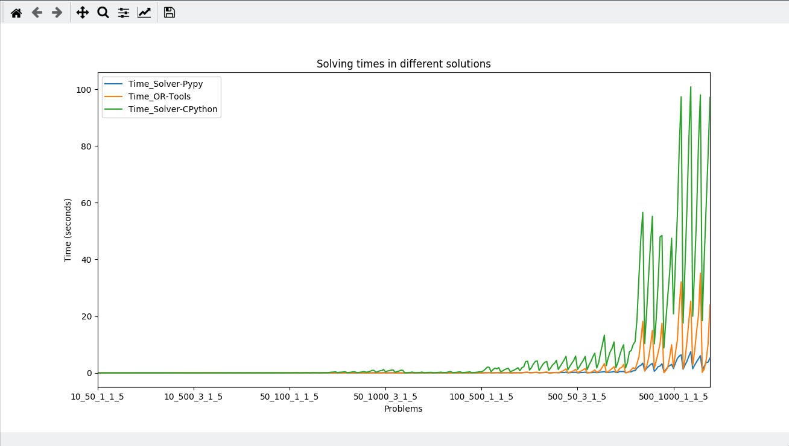

# Αλγόριθμοι και Πολυπλοκότητα

Επίλυση προβλήματος Knapsack 0-1 για 320 τυχαία προβλήματα:

1. με τη χρήση OR Tools

2. με ξεχωριστή υλοποίηση

## Με χρήση CPython

Ο κώδικας έχει ελεγχτεί μόνο με Python3 (3.7), δεν είναι γνωστό αν τρέχει σε Python2.

### Main.py
Η συνάρτηση **knapSack**, ο κώδικας της οποίας προέρχεται [από την ιστοσελίδα GeeksForGeeks](https://www.geeksforgeeks.org/0-1-knapsack-problem-dp-10/), σε περιγραφή του σχετικού προβλήματος.

Η συνάρτηση **mainSolver** είναι η κύρια συνάρτηση η οποία εκτελεί τους δύο επιλυτές, εξάγει τα δεδομένα με τις λύσεις του κάθε προβλήματος στο αρχείο result.csv μαζί με τους χρόνους εκτέλεσης τους και κατόπιν δημιουργεί γράφημα μέσω της βιβλιοθήκης Matplotlib στο οποίο συγκρίνει τους χρόνους εκτέλεσης του κάθε προβλήματος και για τους δύο τρόπους επίλυσης.

### Test.py (unit tests)
Περιέχει την κλάση TestSolvers η οποία έλεγχει την σωστή λειτουργία του κυρίους προγράμματος (main.py) μέσω 3 μεθόδων οι οποίες εφαρμόζονται σε 3 προβλήματα (μικρού-μεσαίου-μεγάλου μεγέθους). 

### ResultsCPython.csv

Περιέχει τα αποτελέσματα απο την εκτέλεση των αλγορίθμων με CPython (όνομα αρχείου, χρόνος εκτέλεσης με OR-Tools, χρόνος εκτέλεσης απλού επιλυτή, συνολική αξία, συνολικό βάρος).


# Με χρήση Pypy

Η Pypy είναι μία εναλλακτική υλοποίηση της Python που παρέχει πολύ πιο γρήγορο χρόνο εκτέλεσης σε σύγκριση με την προεπιλεγμένη υλοποίηση της Python (CPython). Το κυριότερο μειονέκτημα ωστόσο είναι ότι δεν υποστηρίζονται απαραίτητα όλες οι βιβλιοθήκες που είναι διαθέσιμες για Python.

Επειδή οι βιβλιοθήκες OR Tools και Matplotlib δεν υποστηρίζονται σε Pypy, δοκιμάσαμε να τρέξουμε μόνο την δεύτερη υλοποίηση και να αποθηκεύσουμε τους χρόνους σε αρχείο .csv, ώστε να δούμε την διαφορά με την CPython. Οι υλοποιήσεις βρίσκονται στα αρχεία **mainPypy.py** και **testPypy.py**

Για να εγκατασταθεί η Pypy σε Debian 10 Buster χρειάστηκαν τα ακόλουθα βήματα:

Εγκατάσταση του συστήματος διαχείρισης πακέτων και επεκτάσεων Conda (χρησιμοποιήθηκε το Miniconda)

Ενεργοποίηση του Conda για το κέλυφος Bash που χρησιμοποιείται: conda init bash

Δημιουργία και ενεργοποίηση ενός εικονικού περιβάλλοντος για το Pypy:

```
conda create --name pypy_env
conda activate pypy_env
```

Εγκατάσταση του Pypy3 σε αυτό:

```
conda install pypy3
```

Εγκατάσταση του pip (διαχειριστής πακέτων και προαπαιτούμενων στην Python):

```
pypy3 -m ensurepip
```

Εγκατάσταση βιβλιοθηκών απαραίτητες για να δουλέψει το Pandas:

```
pypy3 -mpip install cython
pypy3 -mpip install numpy
```

Τέλος, εγκατάσταση του Pandas:

```
pypy3 -mpip install pandas
```

## ResultsPypy.csv

Περιέχει τα αποτελέσματα απο την εκτέλεση του απλού επιλυτή με Pypy (όνομα αρχείου, χρόνος εκτέλεσης του απλού επιλυτή).

# Αποτελέσματα



Συγκριτικό διάγραμμα χρόνων εκτέλεσης με χρήση της Matplotlib (αρχείο `plot.py`). 
